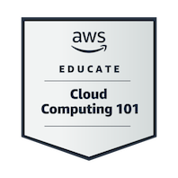

# ☁️ Cloud-journey 🚀

¡Este repo es un recorrido de lo que he ido aprendido en mi camino para ser un experto en la nube \! Aquí documento mi aprendizaje, soluciones implementadas y experimentos en diferentes plataformas cloud.

El propósito de este `Cloud-journey` es: Documentar el aprendizaje y la implementación de soluciones en la nube.

---

## 📂 Estructura del Repositorio

Cada proyecto o experimento en la nube reside en su propia carpeta dedicada dentro de este repositorio. Esto ayuda a mantener la organización y la independencia de cada iniciativa.

```
.
├── Host static Website on S3 bucket/
│   ├── Files...
│   └── ...
├── Visualize data with QuickSight/
│   ├── Files...
│   └── ...
├── Otros proyectos.../
├── README.md             <-- Este archivo
```

Dentro de algunas de las carpetas de proyectos podras encontrar un PDF dado por la plataforma https://learn.nextwork.org/ en donde
se explica paso a paso como logre hacerlo correctamente.

---

## 🚀 Proyectos y Exploraciones

A continuación, se listan los proyectos y las exploraciones que forman parte de este `Cloud-journey`. Haz clic en cada enlace para ir a la carpeta específica del proyecto y obtener más detalles.

| Proyecto/Exploración                      | Descripción Breve                                                                                                         | Tecnologías Clave | Estado      |
| :---------------------------------------- | :------------------------------------------------------------------------------------------------------------------------ | :---------------- | :---------- |
| [**`Host static Website on S3 bucket/`**] | Una website estatica desplegada en Amazon S3 bucket                                                                       | S3, HTML          | Completado  |
| [**`Visualize data with QuickSight/`**]   | Creacion de dashboards, manejo y visualizacion de data a traves de QuickSight conectado a un Amazon S3 bucket con la data | QuickSight, S3    | Completado  |
| [**`Cloud Security with AWS IAM/`**]      | ----                                                                                                                      | ----              | En progreso |

---

## 🛠️ Tecnologías Utilizadas hasta ahora

Este repositorio abarca una variedad de servicios y herramientas en la nube, incluyendo (pero no limitado a):

- **Proveedores Cloud:** AWS,
- **Infraestructura como Código (IaC):** Terraform, AWS CloudFormation
- **Computación:** AWS Lambda
- **Bases de Datos:** S3
- **Redes:**
- **CI/CD:**
- **Monitoreo y Logging:**

---

## 🏅 Mis Insignias de Credly

[AWS EDUCATE INTRODUCTION TO CLOUD 101](https://www.credly.com/badges/7351c0ee-1623-4254-ba16-02b8ba0c0d57/public_url)


## 📞 Contacto

¿Tenés alguna pregunta o querés discutir algo sobre cloud? ¡No dudes en contactarme estoy abierto a trabajar en proyectos cloud \!

- **Contacto en proceso de creacion...**
